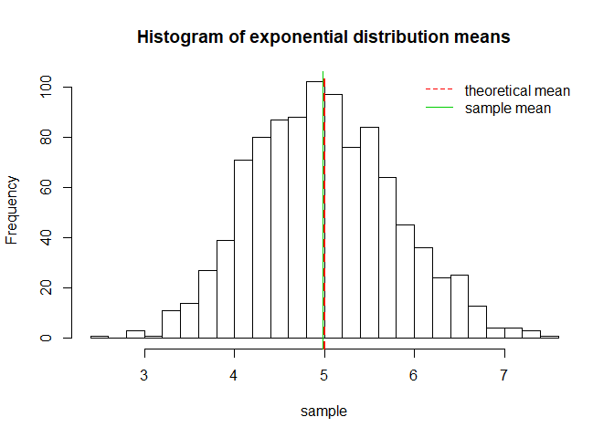
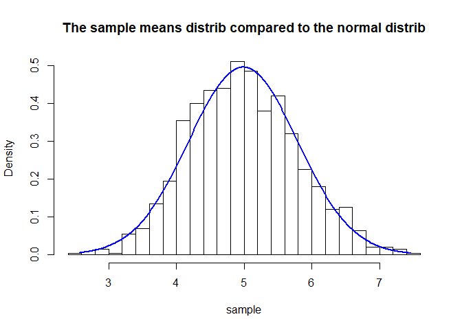
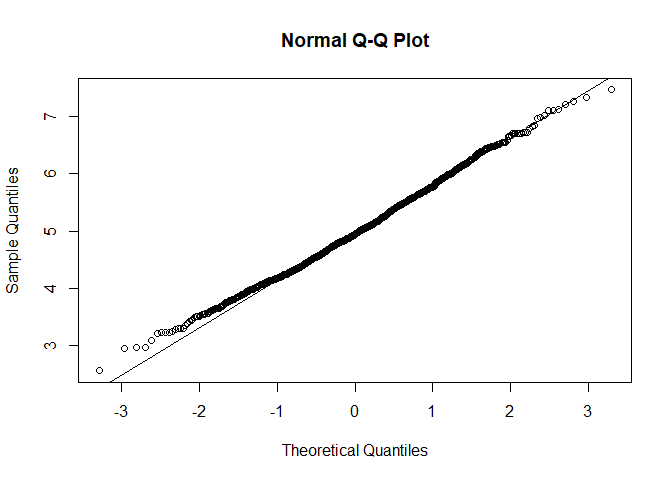

# Synopsis


In this project we've investigated the exponential distribution and applaying the Central Limit Theorem. So, we've simulated the exponential distribution more than 1000 times and illustrated its caracteristics according to the Central Limit Theorem.


Our based steps are
+ Show the sample mean and compare it to the theoretical mean of the distribution.
+ Show how variable the sample is (via variance) and compare it to the theoretical variance of the distribution.
+ Show that the distribution is approximately normal.


##The sample mean and the theoretical mean in comparison


The following code will run a simulation which is creating 1000 samples of 40 exponential random observations.

```r
lambda<-0.2 #rate parameter

mu <- 1/lambda # th mean
sim <- 1000 # number of simulations
n <- 40 # number of observations

set.seed(3)

sample <- NULL
for (i in 1 : sim) sample <- c(sample, mean(rexp(n,lambda)))
sample_mean <- mean(sample)

hist(sample,main="Histogram of exponential distribution means", breaks="FD")
abline(v = mu, col= 2, lwd = 2,lty=2)
abline(v = sample_mean, col= 3, lwd = 1)
legend("topright", c("theoretical mean", "sample mean"), 
       lty= c(2,1), bty = "n", col = c(col = 2, col = 3))
```

<!-- -->

So, the expected (theoretical) mean of exponential distribution is 5 and the average sample mean is 4.987. We can see that they are so close, as the Central Limit Theorem predicted to.


##Sample and theoretical variances in comparison


As we know, the theoretical variance is equal to the variance of the original population divided by the number of sample observations. Let's look at the following.

```r
std <- 1/lambda # th std dev

sigma <- std^2/n #expected Var()
sample_sigma <- var(sample) #sample Var()

sigma
```

```
## [1] 0.625
```

```r
round(sample_sigma,3)
```

```
## [1] 0.632
```
Now, we can see that they are almost equal. How the Central Limit Theorem predicted to, central moments of the theoretical and the sample distributions are almost equal.


##The sample means distrib and the normal distrib in comparison


The following hist-plot shows that the means of the exponential distribution sample are very approximate to the normal distribution.

```r
xfit <- seq(min(sample), max(sample), by=0.01)
yfit <- dnorm(xfit, mean = sample_mean, sd = sqrt(sample_sigma*n/(n-1)))

hist(sample, breaks = "FD", freq=F,
     main = "The sample means distrib compared to the normal distrib")
lines(xfit, yfit, col="blue", lwd=2)
```

<!-- -->

Another way to comparing is the qqplot.


```r
qqnorm(sample)
qqline(sample)
```

<!-- -->


As we can see, our sample is on the "normal" line.


# Conclusion


In our analysis which based on simulation, we considered the most common assumptions of the Central Limit Theorem. We shown that central moments and also distribution of sample means of the exponential distribution (e.g.) are near to the normal distributone in general.


